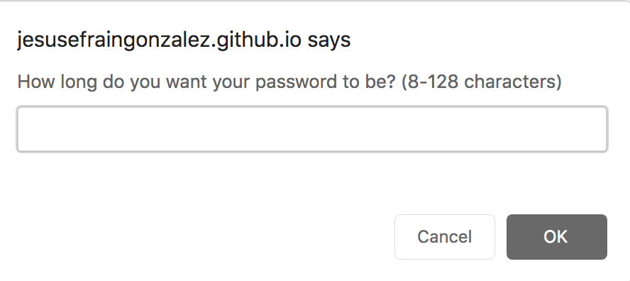
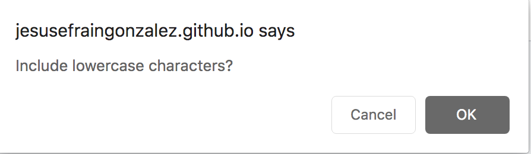
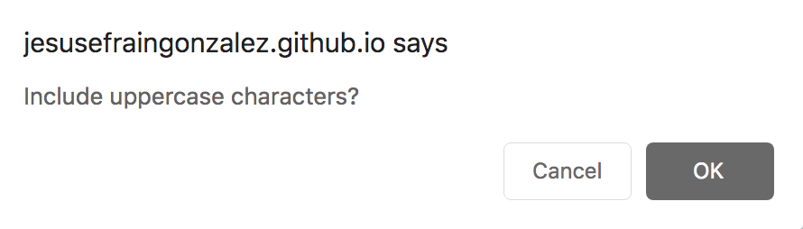
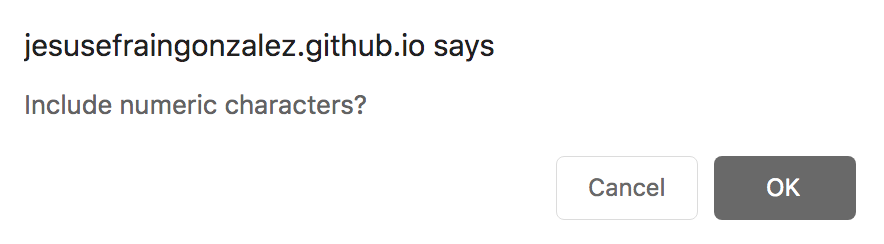
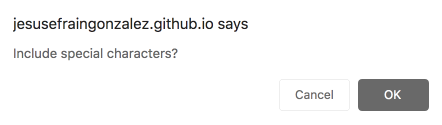
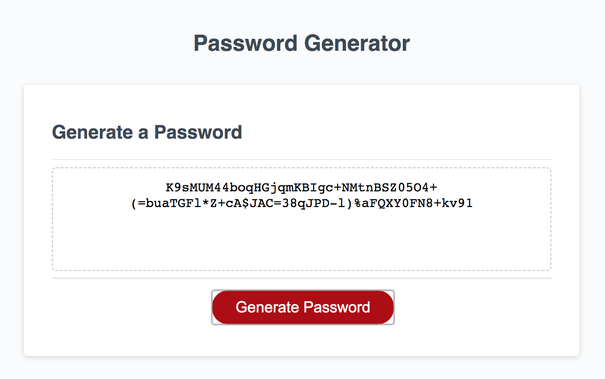

# Password Generator

## Introduction
A password generating applet to create a secure password using user selected criteria.

## How to Use
1. Click on the generate password button
2. Answer the prompts for password criteria
3. Copy and paste your password

## Design
Simple card layout. Button to begin password generation process. Alerts and confirms to prompt user for desired password criteria. 

## Files and Directory
* password-generator
    * Assets
    * Develop
        * index.html
        * script.js
        * alt-script.js
        * style.css
    * README.md
    * todo.md

## Link
[Link to Live Website](https://jesusefraingonzalez.github.io/password-generator)

## ScreenShots

